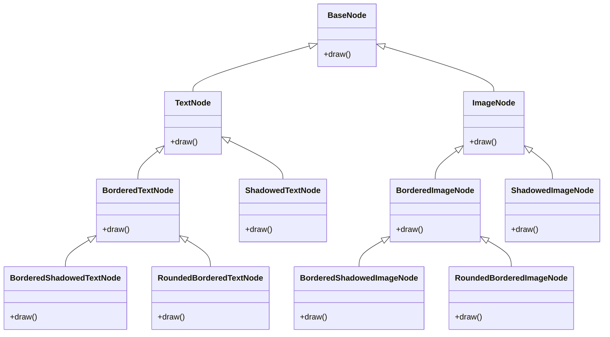

# 데코레이터 패턴 소개

## 1. 데코레이터 패턴이란?

데코레이터 패턴은 객체지향 디자인 패턴 중 하나로, 객체에 동적으로 새로운 책임을 추가할 수 있게 해줍니다. 이 패턴은 상속을 사용하여 기능을 확장하는 것보다 유연한 대안을 제공합니다.

주요 특징:
- 기존 코드를 수정하지 않고 객체의 기능을 확장할 수 있습니다.
- 런타임에 동적으로 기능을 추가하거나 제거할 수 있습니다.
- 단일 책임 원칙을 지키면서 기능을 조합할 수 있습니다.

## 2. 복합체 패턴과의 관계

데코레이터 패턴은 종종 복합체 패턴과 함께 사용됩니다. 복합체 패턴이 객체들의 트리 구조를 표현한다면, 데코레이터 패턴은 이러한 객체들에 동적으로 새로운 기능을 추가하는 데 사용됩니다.

예를 들어, 그래픽 시스템에서:
- 복합체 패턴: 기본 도형들을 조합하여 복잡한 그래픽 구조를 만듭니다.
- 데코레이터 패턴: 각 도형에 테두리, 그림자 등의 효과를 동적으로 추가합니다.

## 3. 나쁜 코드 예시: 상속의 과도한 사용

다음은 상속을 과도하게 사용하여 기능을 확장하는 나쁜 코드의 예시입니다:

```typescript
class Rect {
  // 기본 사각형 구현
}

class BorderedRect extends Rect {
  // 테두리가 있는 사각형
}

class ShadowedRect extends Rect {
  // 그림자가 있는 사각형
}

class BorderedShadowedRect extends BorderedRect {
  // 테두리와 그림자가 모두 있는 사각형
}

// 새로운 효과를 추가할 때마다 클래스가 기하급수적으로 증가...
```

이 접근 방식의 문제점:
1. 클래스 폭발: 새로운 기능 조합마다 새 클래스를 만들어야 합니다.
2. 유연성 부족: 런타임에 동적으로 기능을 추가하거나 제거하기 어렵습니다.
3. 복잡성 증가: 클래스 계층 구조가 깊어지고 복잡해집니다.

## 4. 철수의 시나리오: 상속의 함정

주니어 개발자 철수의 이야기를 통해 상속의 과도한 사용이 어떤 문제를 일으킬 수 있는지 살펴봅시다:

1일차: 철수는 기본적인 도형 클래스들을 만듭니다.
3일차: 테두리 기능 요청이 와서 각 도형마다 테두리 버전 클래스를 만듭니다.
5일차: 그림자 기능 요청이 와서 또 각 도형마다 그림자 버전 클래스를 만듭니다.
7일차: 테두리와 그림자를 동시에 적용해달라는 요청에 철수는 고민에 빠집니다.
10일차: 둥근 테두리 요청이 오자 철수는 클래스 폭발 현상을 경험합니다.
12일차: 버그 수정이 필요할 때마다 여러 클래스를 동시에 수정해야 하는 상황에 직면합니다.
15일차: 철수는 결국 도움을 요청하고, 선임 개발자가 데코레이터 패턴을 소개합니다.




## 5. 데코레이터 패턴의 해결책

데코레이터 패턴을 사용하면 위의 문제들을 다음과 같이 해결할 수 있습니다:

```typescript
interface Shape {
  draw(): void;
}

class SimpleShape implements Shape {
  draw() {
    // 기본 도형 그리기
  }
}

abstract class ShapeDecorator implements Shape {
  protected wrappedShape: Shape;

  constructor(shape: Shape) {
    this.wrappedShape = shape;
  }

  draw() {
    this.wrappedShape.draw();
  }
}

class BorderDecorator extends ShapeDecorator {
  draw() {
    super.draw();
    // 테두리 추가 로직
  }
}

class ShadowDecorator extends ShapeDecorator {
  draw() {
    super.draw();
    // 그림자 추가 로직
  }
}

// 사용 예
let shape = new SimpleShape();
shape = new BorderDecorator(shape);
shape = new ShadowDecorator(shape);
shape.draw(); // 테두리와 그림자가 있는 도형이 그려집니다.
```


이 접근 방식의 장점:
1. 유연성: 런타임에 동적으로 기능을 추가하거나 제거할 수 있습니다.
2. 단일 책임 원칙: 각 클래스는 하나의 책임만 가집니다.
3. 개방-폐쇄 원칙: 기존 코드를 수정하지 않고도 새로운 기능을 추가할 수 있습니다.
4. 조합의 용이성: 다양한 기능을 자유롭게 조합할 수 있습니다.

데코레이터 패턴을 사용하면 코드의 유연성과 재사용성이 크게 향상되며, 새로운 요구사항에 더 쉽게 대응할 수 있습니다.
